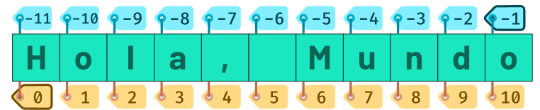

# Cadenas de texto (Strings)

Los strings son secuencias de caracteres, que se pueden almacenar

Para creaar un string simplemente debemos encasillar los que queramos entre ' ', de esta manera:

```python
>>> 'Hola me "username" es Pepe222'

'Hola me "username" es Pepe222'
```

Como se ve en el ejemplo, se puede añadir de todo en medio de un string, incluyendo comillas y números

En el caso de que quisieramos colocar comillas simples dentro, deberiamos cambiar las comillas de fuera por unas dobles

```python
>>> "Hola 'Pepe222'"

"Hola 'Pepe222'"
```

Hay otra forma más de crear strings, y esta es con comillas triples. este tipo de strings normalmente se utiliza para cadenas multilineas, como por ejemplo, la documentación de código.

```python
>>> master_of_puppets = """ Master of Puppets es una canción de la banda de trash metal Metallica de su album homónimo de 1986""""
```

Y al igual que se pueden crear string con contenido, también se pueden hacer strings completamente vacios de esta sencilla manera:

```python
>>> ''

''
```

Gracias a la función str(), podemos convertir otros tipos de datos a strings:

```python
>>> str(True)
'True'

>>> str(100)
'100'
```

En el caso de que lo que quisieramos convertir es un string a cualqueir otro tipo, simplemente debemos usar las funciones ya vistas en anteriores temas:

```python
>>> bool('True')
True

>>> int('100')
100
```

También hay que destacar que la funcion int admite la base del numero correspondiente, por lo cual podemos pasarle un número cualquiera como string (en este caso, lo pasamos en hexadecimal) y podemos pasarlos a su valor entero:

```python
>>> int('FF', 16)

255
```

En Python se puede escapar el significado de algunos caracteres para conseguir resultados diferentes. Si escribimos \ en un string antes del caracter a escapar, podemos otorgar otro significado.

Porbablemente la secuencia de salto de linea (\n) es la mñas conocida de todas, aunque se pueden realizar muchas otras, que podremos ver más adelante, aunque vamos a ver unas pocas:

- Salto de línea
```python
>>> alphabet = 'a\nb\nc\n' 
>>> print(alphabet)

a
b
c
```

- Tabulador

```python
>>> msg = 'Saludo = \tHola'
>>> print(msg)

Saludo =    Hola
```

- Comilla simple

```python
>>> msg = 'Este texto \'hola\' esta entre comillas simples'
>>> print(msg)

Este texto 'hola' esta entre comillas simples'
```

- Barra invertida

```python
>>> msg = 'Este texto \\ hola \\ esta barras invertidas'
>>> print(msg)

Este texto \ hola \ esta barras invertidas
```

Pero: ¿que pasaría si quisieramos que estos caracteres especiales pierdan el significado que poseen para poder usarlos de otra manera?. Para ello simplemente tendríamos que usar el raw data en el texto que queramos modificar. Este es representado con la letra r. Este metodo es muy usado para las llamadas expresiones regulares.

```python
>>> text = 'abc\nABC'

>>> print(text) 
abc
ABC

>>> text = r'abc\nABC'

>>> print(text) # debería hacer el salto de linea pero al incluir el r antes del texto entre comillas simples, imprime el texto literal
abc\nABC
```

Ahora veremos algunas cosas más sobre la función print(), ya que admite muchos más parámetros:

```python
>> msg1 = 'Hola'
>> msg2 = 'Amigos'

>>> print(msg1, msg2) # separamos las dos variables entre ellas por comas, por lo cual se imprime el contenido de ambas
Hola Amigos

>>> print(msg1, msg2, sep = '|') # como vimos antes, el separador por defecto es un espacio, por lo cual aquí lo cambiamos por una barra vertical
Hola|Amigos

>>> print(msg1, end = '!!') # aqui cambiamos el valor final por defecto, por dos exclamaciones
Hola!!
```

Pyhton nos permite pasar el pasar datos a traves de teclado. Al escribir los que queramos, el programa leera dicha cosa escrita. Para ello usamos la función input(), la cual se usa así:

```python
>>> name = input('Introduce tu nombre: ')
Introduce tu nombre: José

>>> name
José

>>> type(name)
str
```
Debemos tener en cuenta que input() siempre nos devuelve un string. Por ello muchas veces deberemos hacer conversión explicita.


Aparte en Python, se pueden hacer operaciones con las propias strings:

- Se pueden combinar strings con +:

```python
>>> msg1 = 'Hola'
>>> msg2 = 'que tal'

>>> msg1 + msg2
'Holaque tal'

>>> msg1 + ',' + msg2 # incluimos una coma
'Hola, que tal'
```

- Se pueden repetir strings:

```python
>>> msg1 = 'Hola'

>>> msg1 * 4
'HolaHolaHolaHola'
```

- Una parte importante de las operaciones con string es el indice. Tenemos que tener en cuenta que los strings estan indexados, es decir que cada caracter dentro de la cadena de texto tiene su propio índice, el cual indicamos entre corchetes para acceder a el. Debemos tener en cuenta que el primer caracter siempre va a tener el indice 0 y el caracter final sera una unidad menos de la longituf del string

```python
>>> msg1 = 'Hola, Familia'

>>> msg1[0]
'H'

>>> msg1[6]
'F'

>>> msg1[2]
'l'

>>> msg1[4]
','
```

Debemos destacar la existencia de indices positivos, pero también de indices negativos. A ellos se acceden teniendo en cuenta que el ultimo carácter del string es -1 y a partir de ese, hacia atrás. Aquí una imagen para mayor claridad:




Los strings pueden ser troceados 
