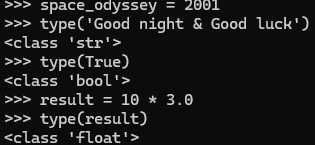

Utilizando la consola interactiva de Python >>>, realiza las siguientes tareas:

- Asigna un valor entero 2001 a la variable space_odyssey y muestra su valor.

- Descubre el tipo del literal 'Good night & Good luck'.

- Identifica el tipo del literal True.

- Asigna la expresión 10 * 3.0 a la variable result y muestra su tipo.

